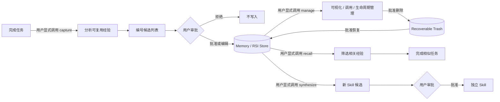

# RSI Skill

一个由用户显式启动、由用户逐条审批的 Agent 经验闭环：任务完成后提炼经验，可视化管理已经保存的内容，在后续同类任务中召回经验，并把成熟经验晋升为新的 Skill。

> 这里的 “self-improvement” 发生在可检查的经验层和 Skill 层，不修改模型权重，也不允许 Agent 静默建立用户画像。

## 动态演示

| Capture → 审批 → Recall | 可视化 → 调用 → 删除 |
|---|---|
|  |  |
| 经验汇总为独立 Skill | Codex / Claude Code / OpenClaw 安装 |
|  |  |

## 为什么做 RSI

普通 Agent 会在一次对话里修复错误，却经常在下一次相似任务中重新踩坑。直接把整段会话塞进长期记忆又会带来噪声、隐私、冲突和不可控更新。RSI 把中间过程变成一个受控协议：



关键设计不是“记得更多”，而是“只保留有证据、适用范围明确、用户愿意保留的内容”。

## 四种显式模式

| 模式 | 典型调用 | 是否写入 | 产物 |
|---|---|---:|---|
| Capture | `$rsi capture` / “用 RSI 复盘刚才的任务” | 审批后才写 | memory 候选、experience 候选 |
| Manage | `$rsi manage` / “展示、调用或删除以前的经验” | 浏览/调用只读；变更需审批 | Markdown 表格或 HTML Dashboard、生命周期操作 |
| Recall | `$rsi recall` / “调用 RSI 里和 CSV 有关的经验” | 否 | 与当前任务相关的经验及应用说明 |
| Synthesize | `$rsi synthesize` / “把这些经验汇总成新 Skill” | 审批后才写 | 可独立安装的新 Skill |

调用 RSI 只代表允许它分析或检索，不代表允许保存。Capture 和 Synthesize 必须经历两个不同的对话回合：先展示编号候选，再由用户批准全部、批准部分、编辑或拒绝。

## 核心保证

- **只允许主动调用**：`agents/openai.yaml` 已设置 `allow_implicit_invocation: false`。
- **先看后存**：新 memory、experience、Skill 都要先以 `M1/E1/S1...` 列表展示。
- **部分审批**：用户可以只批准 `E1, M2`，或要求修改某一项。
- **可视化管理**：对话内表格适合快速浏览；独立 HTML Dashboard 支持搜索、状态和类型筛选。
- **可恢复删除**：`delete` 只移动到 Trash，不提供通配符或永久清除；`restore` 可以恢复。
- **来源可追溯**：经验包含证据、置信度、作用域、适用条件和非敏感来源标签。
- **召回不是命令**：当前用户要求、仓库规则、已验证事实和安全约束始终优先。
- **隐私最小化**：不保存密钥、令牌、原始私有数据、整段对话或 chain-of-thought。
- **跨 Agent 可移植**：核心是 Markdown/JSON 协议；Python CLI 只是可选的可靠实现。
- **并发安全**：本地共享存储使用独占锁和原子替换，多 Agent 不会写出半个 JSON 文件。

## 仓库结构

```text
RSI-skill/
├── SKILL.md                         # 精简入口、模式路由与硬约束
├── agents/openai.yaml               # Codex UI 与显式调用策略
├── references/
│   ├── capture.md                   # 经验提炼与审批流程
│   ├── recall.md                    # 召回、过滤和应用流程
│   ├── manage.md                    # 可视化、精确调用、删除与恢复
│   ├── synthesis.md                 # 从经验合成独立 Skill
│   ├── schema.md                    # 存储、生命周期与并发语义
│   └── adapters.md                  # 多 Agent / API 接入方式
├── schemas/
│   ├── experience.schema.json       # 经验候选 JSON Schema
│   └── proposal.schema.json         # 审批候选 JSON Schema
├── scripts/
│   ├── rsi.py                       # 零第三方依赖的存储与检索 CLI
│   ├── install.py                   # Codex / Claude Code / OpenClaw 安装器
│   └── make_demo.py                 # 生成上方四个多轮演示 GIF
├── tests/
│   ├── test_rsi.py
│   └── test_install.py
└── experiments/                     # 合成检索基准、数据与实测结果
```

## 安装：两种简单方案

### 方案 A：直接让 Agent 安装（推荐）

在本仓库里打开 Codex、Claude Code 或 OpenClaw，把下面这句话发给它：

```text
请帮我安装一下当前仓库的 RSI Skill。 
```

其中 `<你的平台>` 使用 `codex`、`claude-code` 或 `openclaw`。这段请求已经明确授权安装；Agent 不需要让用户手工创建目录，但仍应先展示 dry-run 结果。

### 方案 B：自己运行一条命令

```bash
# 安装到当前平台的用户级目录；默认优先符号链接
python3 scripts/install.py --agent codex
python3 scripts/install.py --agent claude-code
python3 scripts/install.py --agent openclaw

# 同时安装到三个 Agent
python3 scripts/install.py --agent all
```

安装器会先检查所有目标，拒绝覆盖已有文件，并验证目标中的 `SKILL.md`。默认 `--mode auto`：Codex、Claude Code 和用户级 OpenClaw 使用符号链接，因此仓库更新会立即生效；OpenClaw 项目级安装自动使用 copy，避开其 workspace 外部链接信任限制。

| Agent | 用户级目标 | 项目级目标 | 调用 |
|---|---|---|---|
| Codex | `~/.agents/skills/rsi` | `<project>/.agents/skills/rsi` | `$rsi` |
| Claude Code | `~/.claude/skills/rsi` | `<project>/.claude/skills/rsi` | `/rsi` |
| OpenClaw | `~/.openclaw/skills/rsi`；设置变量时为 `$OPENCLAW_STATE_DIR/skills/rsi` | `<workspace>/skills/rsi` | `/rsi` |

这些路径来自 [OpenAI Build skills](https://developers.openai.com/codex/skills)、[Claude Code Skills](https://code.claude.com/docs/en/slash-commands) 和 [OpenClaw Skills](https://docs.openclaw.ai/cli/skills) 官方文档。

### 项目级安装

把 Skill 只提供给一个项目：

```bash
python3 scripts/install.py --agent codex \
  --scope project --project-dir /path/to/project

python3 scripts/install.py --agent claude-code \
  --scope project --project-dir /path/to/project

python3 scripts/install.py --agent openclaw \
  --scope project --project-dir /path/to/openclaw-workspace
```

项目路径必须显式提供，避免误装进 RSI 仓库自身。

如果系统不允许创建符号链接（例如部分 Windows 配置），在任一安装命令后加 `--mode copy`。

### 原生或手工安装

若不想使用安装器，Codex 和 Claude Code 官方都支持 Skill 目录符号链接：

```bash
# Codex
mkdir -p "$HOME/.agents/skills"
ln -s /absolute/path/to/RSI-skill "$HOME/.agents/skills/rsi"

# Claude Code
mkdir -p "$HOME/.claude/skills"
ln -s /absolute/path/to/RSI-skill "$HOME/.claude/skills/rsi"
```

OpenClaw 可直接调用原生命令；不加 `--global` 时安装到当前 workspace，加上后安装到共享 managed skills：

```bash
openclaw skills install /absolute/path/to/RSI-skill --as rsi
openclaw skills install /absolute/path/to/RSI-skill --as rsi --global
```

Codex 和 Claude Code 通常能发现运行中发生的 Skill 变化；如果新建顶层目录后没有出现，重启对应会话。OpenClaw 默认在下一次 Agent turn 由 watcher 刷新；关闭 watcher 时新建会话。

### 跨 Agent 架构

Planner / Executor / Reviewer 架构中，建议只有 Coordinator 有经验库写权限。Worker 可以提交候选事实，但内部 Agent 的多数票不能代替用户审批：

```text
Executor ─┐
Reviewer ─┼─> Coordinator ─> M1/E1/S1 候选列表 ─> User
Planner  ─┘          ^                              │
                    └──────── 只提交批准项 ─────────┘
```

更完整的单 Agent、共享多 Agent、事件 API 和原生 memory/skill registry 适配方式见 [`references/adapters.md`](references/adapters.md)。

## 快速开始

不需要预先初始化：第一次经过审批的写入会惰性创建 `.rsi/`。若要手动创建空存储，可明确执行：

```bash
python3 scripts/rsi.py --store .rsi init --approved
```

默认本地布局：

```text
.rsi/
├── experiences/xp-<timestamp>-<hash>.json
├── trash/xp-<timestamp>-<hash>.json
├── generated-skills/
├── memory.md
└── audit.jsonl
```

`.rsi/` 仍可能包含用户批准过的敏感派生信息。个人经验库建议加入 `.gitignore`；团队经验库只有在完成脱敏并明确决定共享后才提交版本控制。

## 使用 Case 0：展示、调用、删除与恢复经验

**User**

```text
$rsi manage 展示我以前保存的全部经验。
```

**Agent（只读）**

```text
RSI Library · active=2 · archived=1 · trash=0 · showing=3

| Ref | Record ID | Title | Kind | Scope | Confidence | Outcomes | Status |
|---|---|---|---|---|---:|---:|---|
| R1 | xp-...-7ac91d2e | 保留 CSV 编号前导零 | procedure | workspace | 0.93 | 3✓/0✗/3 | active |
| R2 | xp-...-ad42c833 | API 限流时遵守 Retry-After | procedure | global | 0.91 | 2✓/1✗/3 | active |
| R3 | xp-...-b1298e0a | 旧版打包命令 | tooling | workspace | 0.72 | 1✓/1✗/2 | archived |

你可以说“调用 R2 完成当前任务”“查看 R1”“删除 R1”或“恢复 Trash 中的记录”。
```

`R1/R2...` 只在最近一次展示中有效。执行命令前，Agent 会将它解析成完整的 `xp-...` ID。

**User**

```text
调用 R2 处理现在的 429 重试问题。
```

**Agent（只读，无需审批）**

```text
已调用 xp-...-ad42c833：遵守服务器 Retry-After，并加入有界 jitter。
这会改变当前实现的等待时间计算和重试测试；不会修改经验库统计。
```

若用户改为说“删除 R1”，Agent 不会立即执行：

```text
D1 · delete-to-trash
记录：xp-...-7ac91d2e · 保留 CSV 编号前导零
影响：从正常展示和所有 recall 中移除，移动到 .rsi/trash/。
恢复：可通过 RSI manage restore 恢复。

请批准 D1 或取消。
```

用户回复“批准 D1”后才会移动。恢复也会先展示精确记录与原状态，再等待审批。

### 独立 HTML Dashboard

经验较多时，可以生成带全文搜索、类型和状态筛选的只读 Dashboard：

```bash
python3 scripts/rsi.py --store .rsi visualize \
  --format html --status all --output /tmp/rsi-library.html
```

Dashboard 的按钮只复制 `$rsi recall ...` 或 `$rsi manage delete ...` 请求，不会从浏览器直接修改 Store。HTML 包含经验正文，不应保存到公开目录。已存在的输出文件不会被覆盖。

## 使用 Case 1：任务后提炼经验，并只批准一部分

下面是完整的多轮协议，而不是一句“已帮你记住”。

**User**

```text
CSV 导入器已经修好，测试也通过了。$rsi capture
```

**Agent**

```text
E1 · experience · procedure · scope=workspace
标题：保留编号列的前导零
经验：在 schema inference 前，将 SKU / account_id 一类编号列读为字符串。
适用：数字外观但不参与数学运算的 CSV 标识符。
避免：把所有数字外观列直接转成整数。
证据：修复后 leading_zero 回归测试通过。
置信度：0.93

M1 · memory · scope=global
内容：用户偏好在完成报告里看到具体测试证据。
证据：本轮用户要求输出测试结果。
置信度：0.62；风险：只有一次观察，可能是临时要求。

请回复：批准全部、批准 E1/M1、修改某项，或全部拒绝。
```

**User**

```text
只批准 E1。M1 不是长期偏好。
```

**Agent**

```text
已保存 E1 -> .rsi/experiences/xp-...-7ac91d2e.json
M1 已跳过；memory 未修改。
```

这里 E1 的存储输入类似：

```json
{
  "kind": "procedure",
  "title": "保留编号列的前导零",
  "lesson": "在 schema inference 前，将编号类 CSV 列读为字符串。",
  "scope": "workspace",
  "task_types": ["csv-import"],
  "applicability": ["字段是数字外观但语义为 SKU 或账号编号"],
  "evidence": "leading_zero 回归测试在修复后通过。",
  "confidence": 0.93,
  "tags": ["csv", "sku", "leading-zero"],
  "avoid": "把所有数字外观列转成整数。",
  "source_task": "csv-import-regression"
}
```

用户批准后，Agent 才能调用：

```bash
python3 scripts/rsi.py --store .rsi save-experience \
  --approved --input /tmp/approved-experience.json
```

如果省略 `--approved`，命令会退出并且不会创建 `.rsi/`。

## 使用 Case 2：下一次任务主动召回

**User**

```text
现在要导入一个商品目录，SKU 不能改变。$rsi recall，然后完成实现。
```

**Agent**

```text
RSI 命中 xp-...-7ac91d2e：编号列在类型推断前按字符串读取。
本次会把 SKU 加入显式 string schema，并新增 000184 的回归用例。
```

CLI 的只读查询为：

```bash
python3 scripts/rsi.py --store .rsi query \
  "商品目录 CSV 导入，保留 SKU 前导零" --limit 5
```

Agent 必须检查召回经验的适用条件是否匹配。如果仓库当前规则要求 SKU 正规化，仓库规则优先，Agent 应解释为什么不采用旧经验。查询不会自动增加使用次数，也不会创建不存在的 Store。

## 使用 Case 3：把成熟经验汇总为新 Skill

**User**

```text
$rsi synthesize 把已经验证过的 CSV 导入经验整理成一个新 Skill。
```

**Agent（仍未创建文件）**

```text
S1 · skill proposal
名称：safe-csv-import
来源：xp-...-7ac91d2e, xp-...-01f96b20, xp-...-8e0c442a
触发：实现或审查包含标识符、编码和日期字段的 CSV 导入流程。
新增行为：先分类字段语义；固定编码策略；生成边界回归用例。
文件：SKILL.md, references/field-types.md, scripts/profile_csv.py
目标：.rsi/generated-skills/safe-csv-import/
调用策略：允许正常自动发现
限制：证据目前只覆盖逗号分隔 UTF-8/UTF-8-BOM 文件。

请批准 S1、修改，或拒绝。批准前不会创建目录。
```

**User**

```text
批准 S1，但名称改成 robust-tabular-import，只覆盖 CSV。
```

因为名称和范围发生了实质变化，Agent 会先展示修订后的 S1；用户再次批准后才创建 Skill、运行验证器，并写入只含来源 ID 的 `rsi-provenance.json`。新 Skill 是独立的，运行时不应依赖 RSI，除非用户明确批准这种依赖。

## CLI 参考

CLI 兼容 Python 3.8+，只使用标准库。

| 命令 | 写入 | 作用 |
|---|---:|---|
| `preview-experience --input FILE` | 否 | 校验并渲染 `E1...` 候选 |
| `save-experience --approved --input FILE` | 是 | 在独占锁内保存一个对象或 JSON 列表；单记录原子替换 |
| `save-memory --approved --input FILE` | 是 | 写入 fallback `memory.md`，自动去重 |
| `query TEXT [--limit N]` | 否 | 结构化字段加权召回 |
| `visualize [--format markdown\|terminal\|json\|html]` | 仅指定新输出文件时 | 可视化、搜索和筛选经验库 |
| `list [--all] [--json]` | 否 | 列出经验 |
| `show ID [--include-trash]` | 否 | 查看完整记录 |
| `recall ID [ID...]` | 否 | 精确调用一条或多条 active 经验 |
| `feedback --approved ID success\|failure\|neutral` | 是 | 记录经批准的应用结果 |
| `archive --approved ID` | 是 | 归档，不做不可恢复删除 |
| `delete --approved ID` | 是 | 移入可恢复的 `.rsi/trash/` |
| `restore --approved ID` | 是 | 从 Trash 恢复原 active/archived 状态 |
| `doctor` | 否 | 检查 Schema、哈希、重复项和文件一致性 |
| `stats [--json]` | 否 | 汇总记录与结果计数 |

所有会改变 Store、Memory 或生命周期的命令都要求 `--approved`。`visualize --output` 只创建一个新的只读视图文件，并拒绝覆盖已有文件。`--approved` 是“调用 Agent 已经获得批准”的本地断言，不是密码学证明。面向服务的部署应把用户看到的 proposal hash 绑定到认证过的 approval token，细节见适配文档。

### Memory fallback

框架有原生 memory API 时，应把经批准的用户偏好写入原生 memory，并在完成报告中说明目的地；没有时可用：

```json
{
  "statement": "完成报告保持简洁，但必须给出实际测试证据。",
  "scope": "global",
  "evidence": "用户在多个任务中明确确认。"
}
```

```bash
python3 scripts/rsi.py --store .rsi save-memory \
  --approved --input /tmp/approved-memory.json
```

Memory 只存稳定的用户偏好，不存对性格、身份或意图的猜测。任务技巧进入 experience，以保留适用条件和证据。

## 检索设计

内置检索不调用外部服务，适合作为可解释 fallback：

- 对 `title`、`tags`、`task_types`、`applicability`、`scope`、`lesson`、`avoid`、`evidence` 分字段加权；
- 使用语料内逆文档频率降低常见词权重；
- 结合记录置信度和已经批准的成功/失败统计；
- 支持英文词和中文字符/双字 token；
- 可用 `--scope`、`--task-type` 先过滤再排序；
- 只返回 active 记录。

这是小型本地库的确定性检索器，不是通用语义向量检索。经验规模较大或同义表达很多时，可以替换为 embedding / hybrid search，但仍要保留审批、作用域和证据过滤。

## 实验与当前结果

仓库包含一个完全离线、可复现的微基准：20 条合成经验对应 20 个后续任务描述，指标是在 Top-k 中找回预设相关经验的比例。

2026-09-04 在 Python 3.8.10 上的实际运行结果：

| 方法 | Recall@1 | Recall@3 | MRR |
|---|---:|---:|---:|
| 无经验上下文 | 0% | 0% | 0.000 |
| 只取最近 3 条 | 5% | 15% | 0.092 |
| 只对 lesson/evidence 做平面词重叠 | 95% | 100% | 0.975 |
| RSI 结构化字段检索 | **100%** | **100%** | **1.000** |

RSI 相对“最近 3 条”的 Recall@3 配对 bootstrap 差值为 **+85 个百分点**，95% 区间为 **[+70, +100]**，10,000 次重采样、固定 seed `20260904`。此外，当前测试套件为 **22/22 通过**，覆盖跨 Agent 安装目标、dry-run、禁止覆盖、链接/复制策略、未审批写入拒绝、敏感信息拒绝、去重、可视化、调用、删除/恢复、中文检索，以及 **8 个并发 writer 全部保留**。

复现：

```bash
python3 experiments/benchmark.py --output experiments/results/latest.json
python3 -m unittest discover -s tests -v
```

原始数据在 [`experiments/fixtures/retrieval_cases.json`](experiments/fixtures/retrieval_cases.json)，机器可读结果在 [`experiments/results/latest.json`](experiments/results/latest.json)，方法和局限见 [`experiments/README.md`](experiments/README.md)。

### 应该怎样解释这些数字

这个基准证明的是：在这 20 个合成复现任务中，结构化存储和检索能稳定把预设经验送回上下文。它**不能**证明：

- Agent 会正确提炼每一条真实经验；
- 召回后一定能提高最终任务成功率；
- 20 条数据上的 100% 能推广到大规模、跨语言或长期演化的经验库；
- RSI 优于某个生产级 embedding/RAG 系统。

下一步有说服力的实验应使用隐藏任务配对：在相同模型、温度、工具权限和预算下，对照 `无 RSI / RSI recall`，由不知道实验条件的评审检查任务通过率、重复错误率、token 成本和过时经验误用率。`experiments/README.md` 给出了建议协议。

## 安全与治理

### 冲突

新候选与旧经验冲突时，不应静默覆盖。Agent 要展示冲突并让用户选择 `保留 / 替换 / 合并 / 缩小作用域`。单次失败通常只适合增加 failure evidence，不足以直接反转一条经过多次验证的经验。

### 过时

经验不是事实源。涉及库版本、API、法律、价格或安全状态时，Agent 必须重新验证当前事实。失效记录应先经用户批准再归档；默认检索不返回 archived 记录。

### 删除与可恢复性

`delete` 会把精确记录移动到可恢复的 `.rsi/trash/`，且和 `restore` 一样要求二次审批。CLI 不提供通配符删除或永久 purge。若用户确实要求不可恢复地擦除数据，应先精确列出目标和备份/恢复影响，再由宿主系统执行符合其权限策略的删除。

### 多租户

不要把个人全局偏好复制到团队 Store。生产系统应为 tenant/user/workspace 做物理或访问控制隔离，并由 Coordinator 做唯一写入者。网络文件系统对本地锁的语义可能较弱，应改用事务数据库或单写服务。

## 开发与验证

```bash
python3 /path/to/skill-creator/scripts/quick_validate.py .
python3 -m unittest discover -s tests -v
python3 experiments/benchmark.py
python3 scripts/make_demo.py
python3 scripts/install.py --agent all --dry-run
```

`scripts/make_demo.py` 需要 Pillow，仅用于重新生成 README GIF；RSI 核心 CLI 没有第三方依赖。

新增规则时请优先修正能够复现的失败，不要因为一个案例不断堆积全局硬规则。`SKILL.md` 保持精简，只放四种模式共享的约束；模式细节应进入对应 reference。

## License

Apache-2.0，见 [`LICENSE`](LICENSE)。
