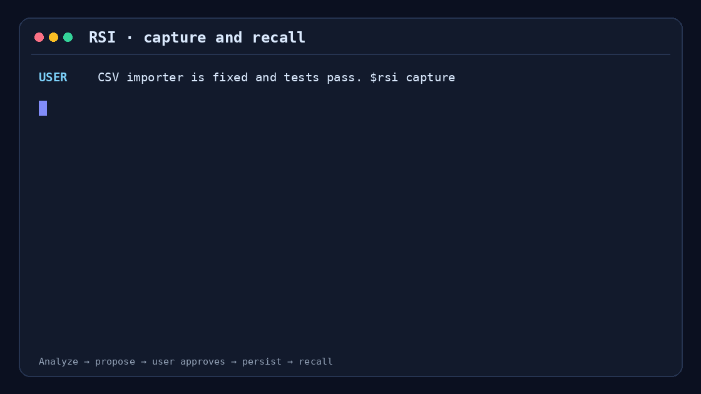
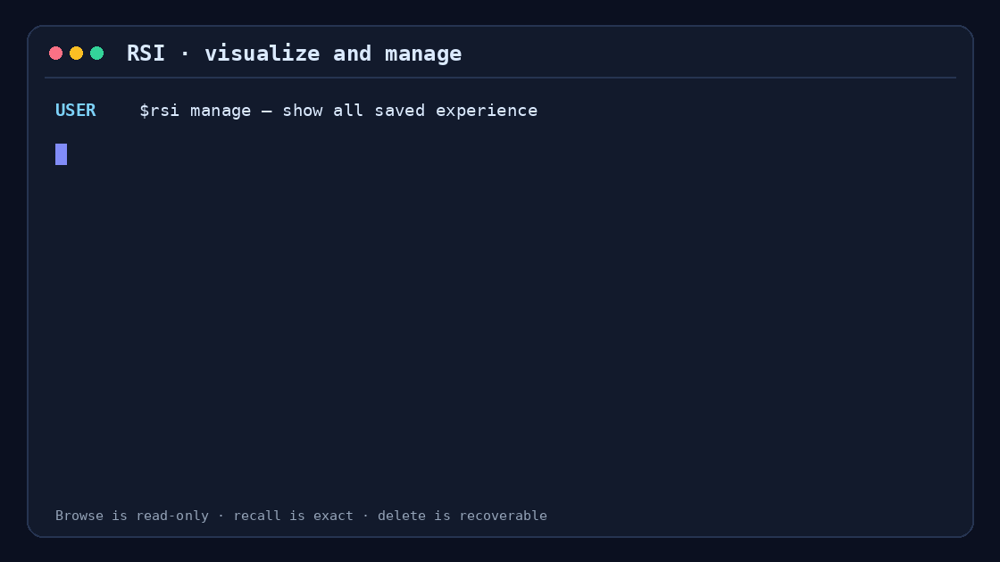
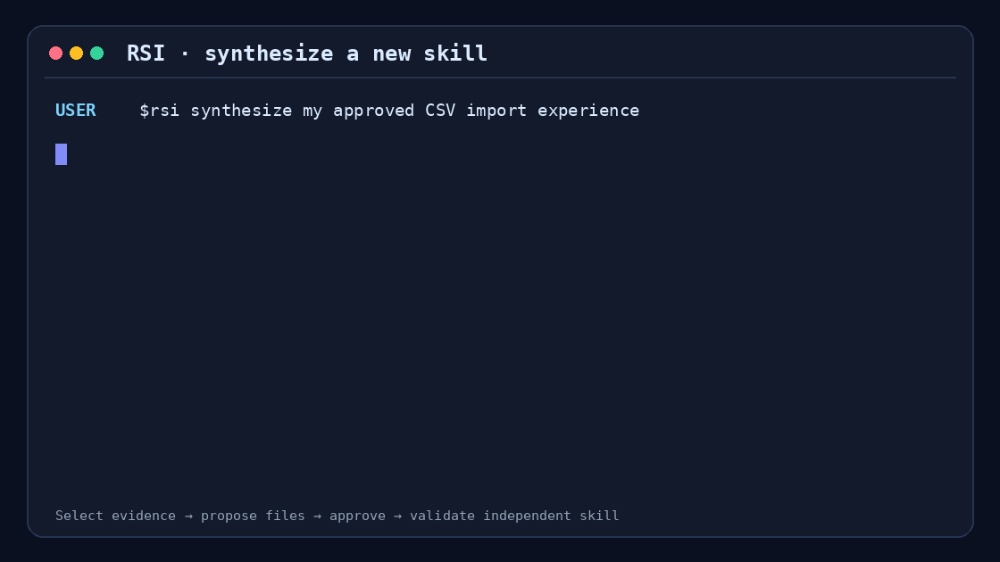
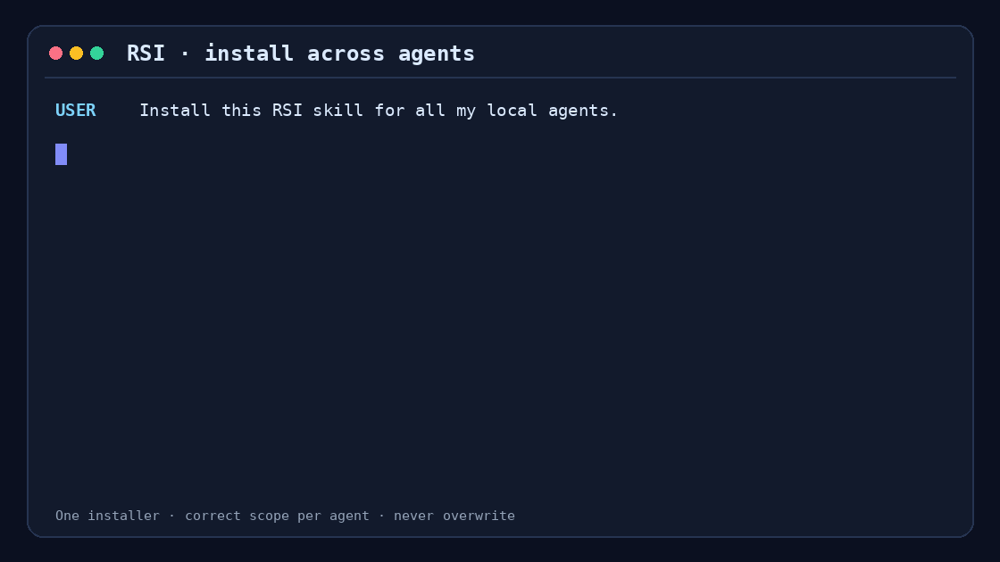
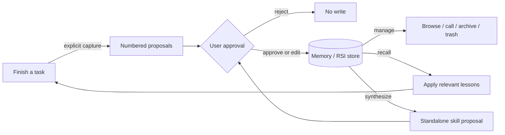

# RSI Skill

**English** | [简体中文](README.zh-CN.md)

A user-governed experience loop for coding agents. After a task, RSI can propose reusable lessons and preferences, save only the items you approve, retrieve them for similar work, let you browse or remove them, and promote mature lessons into a standalone skill.

> Every saved lesson and generated skill stays visible, reviewable, and controlled by the user.

## See it in action

| Capture → approval → recall | Browse → call → delete |
|---|---|
|  |  |
| Promote experience into a skill | Install for three agent hosts |
|  |  |

## Why use it?

Agents often solve a problem once and repeat the same mistake in a later task. Saving complete transcripts is a poor substitute for learning: it is noisy, hard to inspect, privacy-sensitive, and easy to apply outside its original context.

RSI keeps a smaller, controlled loop:



The useful property is not “remember everything.” It is “retain a small lesson with evidence, applicability, scope, and an owner who approved it.”

## Install

### Ask your agent to install it

Open Codex, Claude Code, or OpenClaw in this repository and send:

```text
Install the RSI Skill from this repository for the agent you are currently
running in. First run the matching installer dry-run and show me the target.
Then install it without overwriting an existing skill.
```

### Or run one command

```bash
python3 scripts/install.py --agent codex
python3 scripts/install.py --agent claude-code
python3 scripts/install.py --agent openclaw

# Install for all three user-level hosts
python3 scripts/install.py --agent all
```

The default `auto` mode uses a symbolic link for user-level installs, so repository updates are immediately visible. It refuses to overwrite an existing destination. Use `--dry-run` to inspect the plan or `--mode copy` on systems where links are unavailable.

| Host | User-level destination | Project-level destination | Invoke |
|---|---|---|---|
| Codex | `~/.agents/skills/rsi` | `<project>/.agents/skills/rsi` | `$rsi` |
| Claude Code | `~/.claude/skills/rsi` | `<project>/.claude/skills/rsi` | `/rsi` |
| OpenClaw | `~/.openclaw/skills/rsi` or `$OPENCLAW_STATE_DIR/skills/rsi` | `<workspace>/skills/rsi` | `/rsi` |

Project-only installation requires an explicit target:

```bash
python3 scripts/install.py --agent codex \
  --scope project --project-dir /path/to/project
```

Replace `codex` with `claude-code` or `openclaw` as needed. OpenClaw project installs use a copy by default because links outside its workspace require an additional trust setting.

Manual links are equally valid:

```bash
# Codex
mkdir -p "$HOME/.agents/skills"
ln -s /absolute/path/to/RSI-skill "$HOME/.agents/skills/rsi"

# Claude Code
mkdir -p "$HOME/.claude/skills"
ln -s /absolute/path/to/RSI-skill "$HOME/.claude/skills/rsi"
```

OpenClaw also has a native installer:

```bash
openclaw skills install /absolute/path/to/RSI-skill --as rsi
openclaw skills install /absolute/path/to/RSI-skill --as rsi --global
```

The locations and invocation forms follow the official [Codex skills](https://developers.openai.com/codex/skills), [Claude Code skills](https://code.claude.com/docs/en/slash-commands), and [OpenClaw skills](https://docs.openclaw.ai/cli/skills) documentation.

## The four explicit modes

RSI never runs implicitly. Calling it permits analysis or retrieval; it does not grant permission to write.

| Mode | Example | Writes? | Result |
|---|---|---:|---|
| Capture | `$rsi capture` | Only after approval | Memory and experience proposals |
| Manage | `$rsi manage` | Browsing is read-only; lifecycle changes need approval | Catalog, exact recall, archive, trash, restore |
| Recall | `$rsi recall before this CSV task` | No | Relevant experience and its effect on the task |
| Synthesize | `$rsi synthesize these CSV lessons` | Only after approval | A proposed standalone skill |

Claude Code and OpenClaw use `/rsi` in the examples above. Natural-language requests such as “use RSI to show my saved experience” work when they explicitly name RSI.

### 1. Capture after a task

```text
User: The CSV importer is fixed and its tests pass. $rsi capture

Agent:
E1 · experience · procedure · scope=workspace
Title: Preserve leading zeros in identifier columns
Lesson: Read SKU and account-ID columns as strings before schema inference.
Applies when: Numeric-looking fields are identifiers, not quantities.
Evidence: The leading-zero regression test passed after the change.
Confidence: 0.93

M1 · memory · scope=global
Statement: The user prefers completion notes to include concrete test evidence.
Evidence: Observed once in this task.
Confidence: 0.62; risk: this may be a one-off request.

Approve all, approve E1/M1, edit an item, or reject.

User: Approve E1 only. M1 is not a durable preference.

Agent: Saved E1 as xp-...; M1 was not written.
```

The proposal and approval must be separate turns. Approval can be partial, and a material edit is shown again before saving.

### 2. Browse, call, or remove saved experience

```text
User: $rsi manage — show everything I have saved.

Agent:
RSI Library · active=2 · archived=1 · trash=0

| Ref | Title | Kind | Scope | Confidence | Outcomes | Status |
|---|---|---|---|---:|---:|---|
| R1 | Preserve CSV identifiers | procedure | workspace | 0.93 | 3✓/0✗/3 | active |
| R2 | Honor Retry-After | procedure | global | 0.91 | 2✓/1✗/3 | active |

User: Call R2 for the current 429 retry bug.
Agent: Applying xp-...: honor Retry-After and add bounded jitter.
```

Calling or inspecting a record is read-only. Deletion is a second, approval-gated turn:

```text
User: Delete R1.

Agent:
D1 · delete-to-trash
Record: xp-... · Preserve CSV identifiers
Effect: remove it from normal recall and move it to .rsi/trash/.
Recovery: RSI manage can restore it.

Approve D1 or cancel.
```

The CLI never interprets a wildcard as a deletion target and offers no permanent purge. A standalone, read-only dashboard is also available:

```bash
python3 scripts/rsi.py --store .rsi visualize \
  --format html --status all --output /tmp/rsi-library.html
```

The HTML contains experience text. Do not place it in a public directory.

### 3. Recall for a similar task

```text
User: Import this catalog without changing SKU values. $rsi recall, then implement it.

Agent: Recalling xp-...: treat identifier columns as strings before inference.
       I will add an explicit SKU string schema and a regression case for 000184.
```

Recall is advisory. Current user instructions, repository rules, verified facts, and safety constraints always take precedence. A stale API or tool lesson must be revalidated before use.

### 4. Promote mature experience into a skill

```text
User: $rsi synthesize the validated CSV-import lessons into a new skill.

Agent:
S1 · skill proposal
Name: safe-csv-import
Sources: xp-..., xp-..., xp-...
Behavior: classify field semantics, fix encoding policy, add boundary tests.
Files: SKILL.md, references/field-types.md, scripts/profile_csv.py
Target: .rsi/generated-skills/safe-csv-import/
Evidence coverage: comma-delimited UTF-8/UTF-8-BOM files.

Approve S1, edit it, or reject.
```

Only after approval does the agent create and validate the new skill. The generated skill is standalone and records source IDs in `rsi-provenance.json`; it does not need RSI at runtime.

## The RSI loop

RSI applies recursive improvement to an agent's reusable working knowledge:

- a task produces a candidate lesson;
- approved lessons change how later tasks are handled;
- repeated, validated lessons can produce a new skill;
- that skill can in turn produce new task outcomes and later lessons.

Each cycle can make the next related task more informed, while the user remains in control of what becomes durable experience.

## Storage and portability

No initialization is required. The first approved write lazily creates:

```text
.rsi/
├── experiences/xp-<timestamp>-<hash>.json
├── trash/xp-<timestamp>-<hash>.json
├── generated-skills/
├── memory.md
└── audit.jsonl
```

Add `.rsi/` to `.gitignore` for personal use. Commit a store only when it has been sanitized and intentionally made team-visible.

The skill itself is portable Markdown plus JSON Schema. `scripts/rsi.py` is an optional standard-library reference implementation. Hosts with native memory or skill registries can keep those backends while preserving RSI's approval, evidence, applicability, and scope fields. See [agent architecture adapters](references/adapters.md).

For planner/executor/reviewer systems, make the coordinator the only writer:

```text
Executor ─┐
Reviewer ─┼─> Coordinator ─> numbered proposal ─> User
Planner  ─┘          ^                              │
                    └──── commit approved items ────┘
```

An internal agent vote never substitutes for user approval.

## CLI reference

The CLI supports Python 3.8+ and has no third-party runtime dependencies.

| Command | Writes? | Purpose |
|---|---:|---|
| `preview-experience --input FILE` | No | Validate and render `E1...` candidates |
| `save-experience --approved --input FILE` | Yes | Save an approved record or JSON list |
| `save-memory --approved --input FILE` | Yes | Save approved fallback memory with deduplication |
| `query TEXT [--limit N]` | No | Rank relevant active experience |
| `visualize [--format markdown\|terminal\|json\|html]` | Only when writing a new view file | Search, filter, and display the library |
| `show ID [--include-trash]` | No | Inspect one full record |
| `recall ID [ID...]` | No | Retrieve exact active records |
| `feedback --approved ID success\|failure\|neutral` | Yes | Record an approved application outcome |
| `archive --approved ID` | Yes | Exclude a record from normal recall |
| `delete --approved ID` | Yes | Move a record to recoverable trash |
| `restore --approved ID` | Yes | Restore its former active/archived state |
| `doctor` | No | Check schema, hashes, duplicates, and file consistency |
| `stats [--json]` | No | Summarize records and outcomes |

Every store, memory, or lifecycle mutation requires `--approved`. That flag is a local assertion that the agent already obtained approval; it is not cryptographic proof. A service adapter should bind the displayed proposal hash to an authenticated approval token.

## Evaluation

The repository includes a reproducible offline micro-benchmark with 20 synthetic experience records and 20 recurring-task queries. The metric is intended-record retrieval.

Results reproduced on 2026-09-04:

| Method | Recall@1 | Recall@3 | MRR |
|---|---:|---:|---:|
| No experience context | 0% | 0% | 0.000 |
| Three most recent records | 5% | 15% | 0.092 |
| Flat lesson/evidence overlap | 95% | 100% | 0.975 |
| RSI structured retrieval | **100%** | **100%** | **1.000** |

RSI minus the recency baseline at Recall@3 is **+85 percentage points**, with a paired-bootstrap 95% interval of **[+70, +100]** using 10,000 resamples and seed `20260904`. The current test suite passes **22/22** tests, including approval guards, secret rejection, Chinese retrieval, lifecycle recovery, installation behavior, and eight concurrent writers.

The full fixture, method, and proposed matched-task evaluation are documented in [evaluation notes](experiments/README.md).

Reproduce it with:

```bash
python3 experiments/benchmark.py --output experiments/results/latest.json
python3 -m unittest discover -s tests -v
```

## Safety properties

- No background capture or recall.
- No write before a numbered proposal and explicit approval.
- Partial approval and edits are supported.
- Secrets, credentials, raw private data, full transcripts, and chain-of-thought are excluded.
- Experience carries scope, applicability, evidence, confidence, and outcome counts.
- Conflicts are surfaced as keep/replace/merge/narrow-scope choices rather than silent overwrite.
- Delete means recoverable trash; restore is approval-gated too.
- Stored experience never overrides current instructions or authoritative, current facts.

The local secret scanner is a guardrail, not a data-loss-prevention system. Multi-tenant or networked deployments need real access control, tenant isolation, proposal-bound approvals, and transactional storage.

## Repository map

```text
RSI-skill/
├── SKILL.md                 # Agent entry point, routing, hard constraints
├── agents/openai.yaml       # Codex UI metadata and explicit-only policy
├── references/              # Capture, manage, recall, synthesis, schema, adapters
├── schemas/                 # Experience and proposal JSON Schemas
├── scripts/
│   ├── rsi.py               # Store, retrieval, views, and lifecycle CLI
│   ├── install.py           # Codex / Claude Code / OpenClaw installer
│   └── make_demo.py         # Generates the four GIFs above
├── tests/                   # CLI and installer tests
└── experiments/             # Synthetic retrieval fixture and results
```

## Development

```bash
python3 /path/to/skill-creator/scripts/quick_validate.py .
python3 -m unittest discover -s tests -v
python3 experiments/benchmark.py
python3 scripts/make_demo.py
python3 scripts/install.py --agent all --dry-run
```

`scripts/make_demo.py` needs Pillow only to regenerate the GIFs. The RSI runtime does not.

When changing the skill, prefer a fix supported by a reproducible failure. Keep shared constraints in `SKILL.md` and mode-specific detail in the linked references.

## License

Apache-2.0. See [LICENSE](LICENSE).
